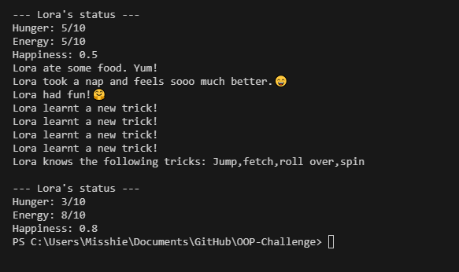

# 🐶 Python OOP Challenge: Digital Pet (Lora)

Welcome to the **Digital Pet** project! This fun Python challenge uses **Object-Oriented Programming (OOP)** to simulate a virtual pet that you can interact with. You’ll get to see real life uses of  classes, attributes, methods, and object behavior.

---

## Features

- Feed your pet to reduce its hunger and boost happiness
- Let your pet sleep to regain energy
- Play with your pet to keep it happy (but don’t forget it gets tired and hungry!)
- Teach your pet new tricks and view all the tricks it has learned
- Get real-time status updates on your pet's mood and needs

---

## Files

- `pet.py` — Contains the `Pet` class with all pet-related logic
- `main.py` — Main script to create a pet and interact with it using class methods

---

## How to Use

1. Clone the repo or download the files.
2. Make sure `pet.py` and `main.py` are in the same directory.
3. Run the main script:

```bash
python main.py
```
## Output example:





